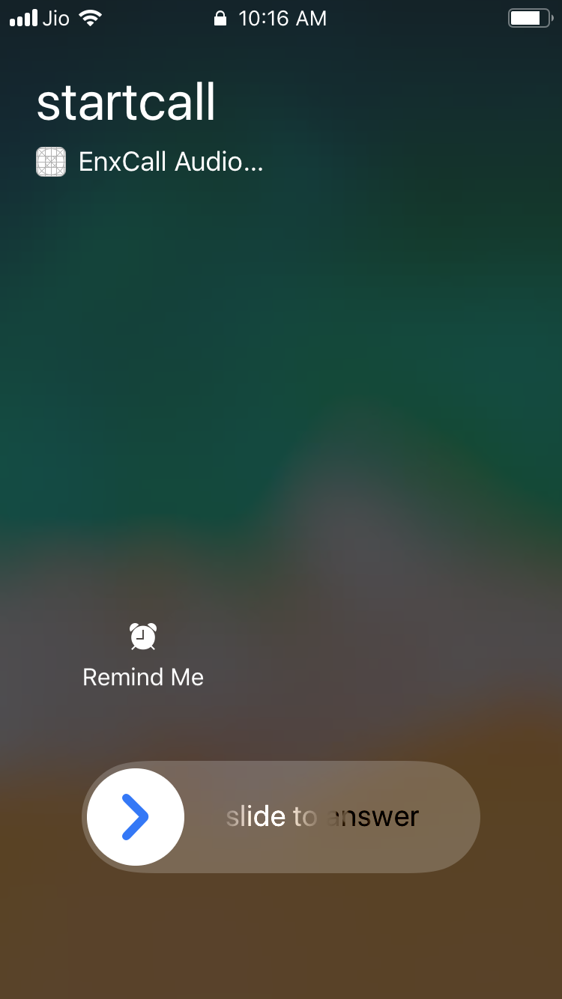

# A Sample iOS App with EnableX iOS Toolkit and Callkit 

This iOS Sample App, demonstrates how to integrate the [CallKit](https://developer.apple.com/documentation/callkit) 
with [EnableX](https://www.enablex.io) platform using iOS Toolkit.

### Note: To try out this code, you’ll need an iPhone with iOS 12.0 or higher
**Note: CallKit is not supported in Simulator* 

### What is CallKit?
CallKit is a framework that aims to improve the VoIP experience by allowing applications to integrate with the native phone UI. 
By adopting CallKit, your app will be able to Use the native incoming call screen in both the locked and unlocked states.

## Installation and pre-requisites:

### Use CocoaPods to install the project files and dependencies.

1. Install CocoaPods as described in [CocoaPods Getting 
Started](https://guides.cocoapods.org/using/getting-started.html#getting-started).\
1.1 In Terminal, `cd` to your project directory and type `pod install`.\
1.2  Reopen your project in Xcode using the new `*.xcworkspace` file.

## 2. How to get started

### 2.1 Pre-Requisites

#### 2.1.1 App Id and App Key 

* Register with EnableX [https://www.enablex.io] 
* Login to the EnableX Portal
* Create your Application Key
* Get your App ID and App Key delivered to your Email

#### 2.1.2 Test Application Server

You need to setup an Application Server to provision Web Service API for your iOS Application to communicate enabling Video Session. 

To help you to try our iOS Application quickly, without having to setup Applciation Server, the Application is shipped pre-configured with EnableX hosted Application Server i.e. https://demo.enablex.io. 

Our Application Server restricts a single Session Duation to 10 minutes, and allows 1 moderator and not more than 3 Participant in a Session.

Once you tried EnableX iOS Sample Application, you may need to setup your own  Application Server and verify your Application to work with your Application Server.  More on this, read Point 2 later in the Document.


#### 2.1.3 Configure iOS Client 

* Open the App
* Go to VCXConstant.swift, it's reads- 

``` 
 /* To try the App with Enablex Hosted Service you need to set the kTry = true
    When you setup your own Application Service, set kTry = false */
    
    let kTry = true

 /* Your Web Service Host URL. Keet the defined host when kTry = true */
    
    let kBasedURL = "https://demo.enablex.io/"
     
 /* Your Application Credential required to try with EnableX Hosted Service
    When you setup your own Application Service, remove these */
    
    let kAppId    = ""
    let kAppkey   = ""
 
 ```
 ### 2.2 Test

 #### 2.2.1 Open the App

 * Open the App in your Device. 
 * You need to create a Room by clicking the "Call Triger" button.
 * Once the Room Id is created, you app will be automatically create "token" and join the join. Same time you can send push notification with same room_id for other end user to join in same room.
 * Once other end user has receive the push notificatio, he/she will parse metadate and get room_Id to join same room. 

 Note: Only one user with Moderator Role allowed to connect to a Virtual Room while trying with EnableX Hosted Service. Your Own Application Server may allow upto 5 Moderators. 
 
 ## 3 Setup Your Own Application Server

 You may need to setup your own Application Server after you tried the Sample Application with EnableX hosted Server. We have differnt variant of Appliciation Server Sample Code, pick one in your preferred language and follow instructions given in respective README.md file.

 *NodeJS: [https://github.com/EnableX/Video-Conferencing-Open-Source-Web-Application-Sample.git]
 *PHP: [https://github.com/EnableX/Group-Video-Call-Conferencing-Sample-Application-in-PHP]

 Note the following:

 * You need to use App ID and App Key to run this Service.
 * Your iOS Client End Point needs to connect to this Service to create Virtual Room and Create Token to join session.
 * Application Server is created using EnableX Server API, a Rest API Service helps in provisioning, session access and pos-session reporting.  

 To know more about Server API, go to:
 https://developer.enablex.io/latest/server-api/
 
 ## 3.1 iOS Toolkit

 This Sample Applcation uses EnableX iOS Toolkit to communicate with EnableX Servers to initiate and manage Real Time Communications. You might need to update your Application with latest version of EnableX iOS Toolkit time as and when a new release is avaialble.  

 * Documentation: https://developer.enablex.io/latest/client-api/ios-toolkit/
 * Download: https://developer.enablex.io/resources/downloads/#ios-toolkit

4. Use Xcode to build and run the app on an iOS device.

### Exploring the sample app

5 **Call Triger**: 


The iOS system boosts the call priority of the app. Then, the app starts publishing to EnableX platform. You will not notice any differences until you go to the home screen.
- An incoming native phone call will not interrupt the current VoIP call, instead it shows the option menu.
- App will show native incoming call UI to answer the call.

**Incoming call unlocak Screen**


**Incoming call lock Screen**



**Recive call lock Screen**


**use a push server or [NWPusher](https://github.com/noodlewerk/NWPusher) to call**

This requires a few more steps:

- create your certificate
- configure your push notification backend or NWPusher
- locate your device token for testing (launch the app and get it from the console)
- send a remote notification from your backend or NWPusher


## Exploring the code
**CXProvider**\
CXProvider is an object which is responsible for report any out-of-band notifications to the system.
To initialize the provider with the appropriate `CXProviderConfiguration` object, A provider configuration specifies the behavior and capabilities of the calls, To pass on the `CXProvider` initializer. In order to receive telephony events of the provider, the provider needs to specify an object conforming to the `CXProviderDelegate` protocol.

```swift
// create a provider 
let providerConfiguration = CXProviderConfiguration(localizedName: "EnxCall")
providerConfiguration.supportsVideo = false
providerConfiguration.maximumCallsPerCallGroup = 1
providerConfiguration.supportedHandleTypes = [.phoneNumber]
providerConfiguration.ringtoneSound = "callTone.caf"

// set up a provider
provider = CXProvider(configuration: type(of: self).providerConfiguration)
provider.setDelegate(self as? CXProviderDelegate, queue: nil)
```

The `CXProviderDelegate` protocol defines events of the telephony provider (`CXProvider`) such as the call starting, the call being put on hold , end call and answer call.

```swift
// MARK: Provider Delegates
func providerDidReset(_ provider: CXProvider) {
for call in callManager.calls{
call.endCall()
}
callManager.removeAllCalls()
}

func provider(_ provider: CXProvider, perform action: CXStartCallAction) {
print("To start a call action")
}

func provider(_ provider: CXProvider, perform action: CXAnswerCallAction) {
print("Answer incoming call action")
}

func provider(_ provider: CXProvider, perform action: CXEndCallAction) {
print("End call action")
}

func provider(_ provider: CXProvider, perform action: CXSetHeldCallAction) {
print("Hold call action")
}

func provider(_ provider: CXProvider, perform action: CXSetMutedCallAction) {
print("Mute call action")
}
``` 

The following methods indicate whether your VoIP call has been successfully priority boosted or recovered.

```swift
func provider(_ provider: CXProvider, timedOutPerforming action: CXAction) {
print("Timed out Action")
// React to the action timeout if necessary, such as showing an error UI.
}

func provider(_ provider: CXProvider, didActivate audioSession: AVAudioSession) {
// Start call audio media, now that the audio session has been activated after having its priority boosted.
}

func provider(_ provider: CXProvider, didDeactivate audioSession: AVAudioSession) {
/*
Restart any non-call related audio now that the app's audio session has been
de-activated after having its priority restored to normal.
*/
}
```

**CXCallController** \
`CXCallController` is responsible to inform the system of user-initiated requests, such as a start call action. This is the key difference between the `CXProvider` and the `CXCallController`. The provider reports to the system whereas the call controller makes requests from the system on behalf of the user.

The call controller uses `CXTransaction` object  to request a telephony action (which will later trigger delegate methods above if succeed).Each telephony action has a corresponding `CXAction` class such as `CXEndCallAction` for ending a call, `CXSetHeldCallAction` for setting a call on hold.

Once you have it all ready, invoke the `request(_:completion:)` by passing a ready transaction object. Here's how you start a call:

```swift
// create a CXAction
let handle = CXHandle(type: .phoneNumber, value: handle)
let startCall = CXStartCallAction(call: UUID(), handle: handle): handle))


// create a transaction
let callTransaction = CXTransaction()
callTransaction.addAction(startCall)

// create a label
let action = "startCall"

callContr.request(callTrans){ error in
if let error = error {
print("Error requesting transaction: \(error)")
} else {
print("Requested transaction \(action) successfully")
}
}

```

As for answering a call, the `CallKit` framework provides a convenient API to present a native call UI. By invoking `reportNewIncomingCall(with:update:completion:)` on the provider, you will have the same experience as receiving a native phone call. Often, this piece of code works with VoIP remote notification to make calls to a device/person same like native call UI experience.

```swift
// Construct a CXCallUpdate describing the incoming call, including the caller.
let update = CXCallUpdate()
update.remoteHandle = CXHandle(type: .phoneNumber, value: handle)

// Report the incoming call to the system
provider.reportNewIncomingCall(with: uuid, update: update) { error in
/*
Only add incoming call to the app's list of calls if the call was allowed (i.e. there was no error)
since calls may be "denied" for various legitimate reasons. See CXErrorCodeIncomingCallError.
*/
}
```

## Demo

EnableX provides hosted Vemo Application of different use-case for you to try out.

1. Try a quick Video Call: https://demo.enablex.io
2. Try Apps on Demo Zone: https://portal.enablex.io/demo-zone/
3. Try Meeting & Webinar:  https://www.enablex.io/ucaas/
